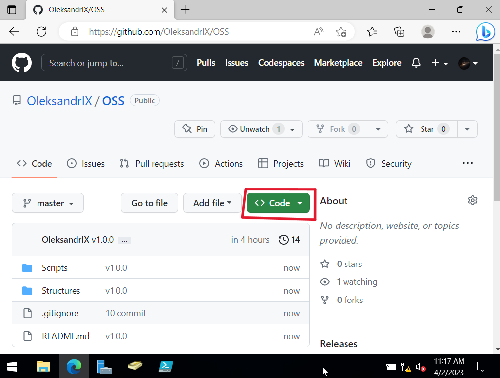
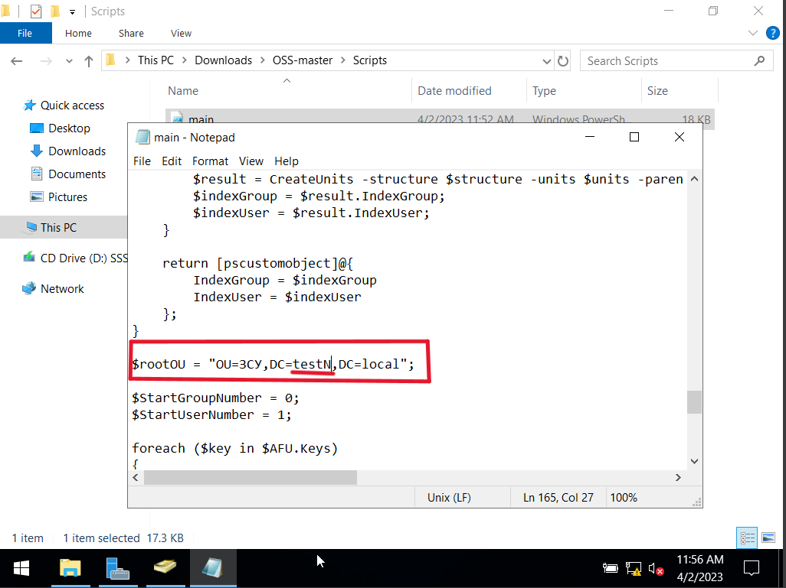

  

### Завантажити `.zip`

  

### Створити новий `OU`

  

### Назвати його `ЗСУ`

  

### Розпакувати `zip` архів.

#### В каталозі `Scripts` відкрити файл в блокноті `main.ps1`
#### В `rootOU` треба замінити `testN` на назву вашого домену.
#### Наприклад `test14`.

  

#### В каталозі `Scripts` виконати скрипт `main.ps1` 

  

